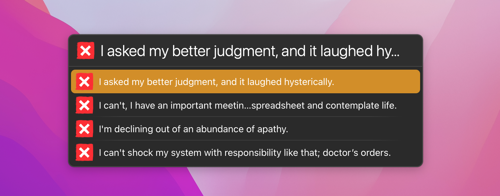

# LaunchBar Action: No-as-a-Service

Get a random, polite way to say "no" from [No-as-a-Service](https://github.com/hotheadhacker/no-as-a-service), right from LaunchBar.

## Usage

- Type `no` and press `↩` to fetch a new rejection reason. It appears at the top of the list, followed by the reasons you've already seen (up to 20 are kept).
- Press `↩` on any reason to copy it to the clipboard.
- Press `␣` (space) and type to search the reasons you've already seen. Results update as you type. Searching doesn't fetch new reasons.
- If the API can't be reached, the action shows the saved reasons instead.

## Install & Update

[Download the latest release](https://github.com/bashu/no-as-a-service-launchbar/releases/latest/download/no-as-a-service.lbaction.zip), unzip it, and double-click `no-as-a-service.lbaction` to install it. LaunchBar checks this repository for updates.

## License

See [LICENSE](LICENSE).
